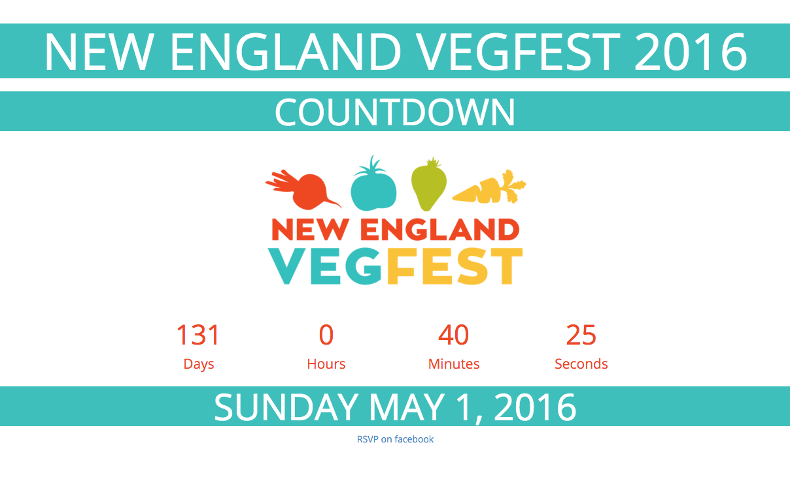
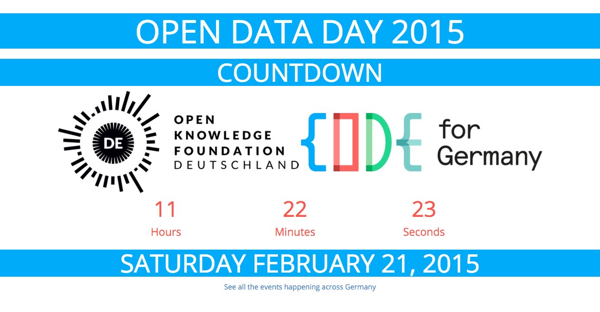
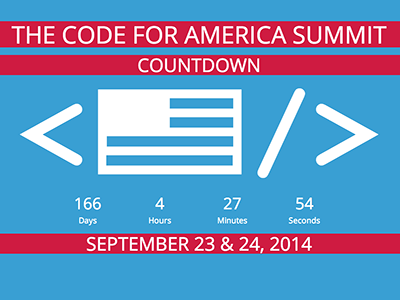
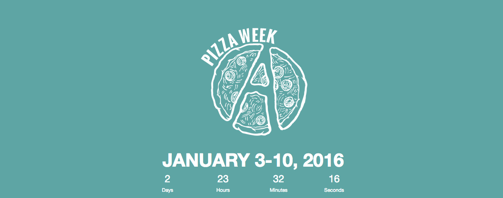
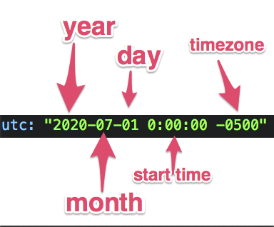

# Countdown

## Make a customized countdown webpage for your upcoming event

### Customize the text, the colors, the logo. Host it for free. You can even use your own custom domain.

# Table of Contents

1. [What is Countdown?](#what-is-countdown)
1. [Examples of Countdown pages in the wild](#examples-of-countdown-pages-in-the-wild)
1. [Basic setup](#basic-setup)
   1. [Set the date of your event](#set-the-date-of-your-event)
   1. [Set the name, description and externalLink of your event](##set-the-name-description-and-externallink-of-your-event)
   1. [Add your logo](#add-your-logo)
1. [Advanced setup](#advanced-setup)
  1. [Choose your colors](#choose-your-colors)
  1. [Customize the font](#customize-the-font)
  1. [Add your own domain name](#add-your-own-domain-name)
1. [What is next for this project](#what-is-next-for-this-project)
1. [How to contribute to this project](#how-to-contribute-to-this-project)

# What is Countdown?

This is an open source tool that helps you easily create a quick, customized single-page site shows a ticking countdown to your event. You just add the `name`, `description`, a `logo` and `date` of your upcoming event or special day, then Countdown generates a webpage with a live countdown of days, minutes, seconds until your event. Hosting is free and you can even add your own custom domain.

**Quick setup, free hosting:** If you are familiar with github, it should only take you a few minutes to set up. This a [Jekyll](https://jekyllrb.com) project that uses [github pages](https://pages.github.com/) for free hosting.

**Why?** I often organize events and I found myself making a handful of webpages like this for each event. I use theses countdown pages as a simple way to check on how long I have left for organizing and promo. I also use them as something to share on social media to build some excitement & anticipation among attendees and participants. Countdown is a way for me to standardize the process and share it. I made this project so it will be easy to fork, customized and launch so you can use it for your upcoming event too. I recommend putting it on `countdown.yourdomain.com`.

# Examples of Countdown pages in the wild

## [New England VegFest 2015 & 2016](http://countdown.newenglandvegfest.com)

## [Open Data Day 2015](http://de.opendataday.org/countdown/)

## [Code for America Summit 2014 & 2015](https://github.com/drewrwilson/Countdown-to-the-Summit)

## [Pizza Week 2015 & 2016](https://pizzaweek.net)

# Basic setup

There are some basic variables that you need to set to make your own countdown webpage. They are all located in the `_config.yml` file in the main directory of this project.

**Required variables:**

 * `utc` - The start time of the event. Best to use UTC format, but may work in other date formats too.
 * `name` - The human-readable name of the event
 * `logo` - logo for the event. replace this logo in the project or add a new file and change the value of this variable
 * `description` - short description of the event. this is used in the preview when the link is shared on facebook
 * `externalLink` - link to the main event page. this could be a webpage, a facebook event, an eventbrite page, where ever the main webpage is for your event

**Optional variables:**
 * `url` - "http://countdown.yourdomain.com" the full URL for this countdown page. This is neccesary for facebook share previews
 * `facebookEventLink` - if you have a facebook event, put the link here and we'll add a "RSVP on facebook" link at the bottom.
 * `hashtag` - hashtag for the event, example "#hashtag". must be in quotes.
 * `colors`
  * `background` - color of the background of the page
  * `primary` - primary color for the page
  * `secondary` - secondary color for the page
  * `textcolor`=  color of the text, which is overlayed on the primary color
 * `fontfamily` - the font-family for the entire site, default: `'Open Sans', sans-serif`

## Set the date of your event

In the `_config.yml` file, change the `utc` variable to be the date and time of your event. If your event is all-day, you can just put the time as 0:00:00. Be sure to include your timezone.

## Set the name, description and externalLink of your event

Similar to setting the date and time of your event, continue editing `_config.yml` to set the `name`, `description` and `externalLink` of your event. Make sure the values are surrounded by quotes.

## Add your logo

The easiest way to add your logo is to replace `logo.png` in this project with your logo file. Then push your changes to your local repo, no need to make any changes to the code. If you prefer, you could link to a logo that is hosted elsewhere on the Internet change the path to the logo in `_config.yml` file to point to this externally-hosted logo.

**Best practices for your logos:**
 * **Transparent background:** Use the PNG format and give it a transparent background. This is not required, but it will make your page look better.
 * **Aspect ratio 16x9:** Your logo should have an aspect ratio of 16x9. The best resolution is `1200px x 675px`. Other sizes will work, but this is the ideal size because it results in high quality facebook and twitter share images.

# Advanced setup

## Choose your colors

You can customize the colors of your Countdown page by editting the `_config.yml` file. Under the color section, change any of thee variables to change the colors: `background`, `primary`, `secondary` and `textcolor`.

## Customize the font

Customize your font by changing `fontfamily` in the `_config.yml` file. Note that the only google font that is currently included in this project is Open Sans. If you would like to use another font that is not included in browsers by default, you will need to add it to your project individually (not recommended for HTML/CSS novices).

## Add your own domain name

There are two steps to adding a custom domain to your countdown.

### Step 1: Buy a domain, point it to github

Buy your domain name. I recommend using [NameCheap](https://www.namecheap.com/). With your registrar, add a CNAME record to your DNS file for your domain and point it to `yourusername.github.io.` I recommend adding a new CNAME record for a new subdomain such as `countdown.yourdomain.com`.

### Step 2: Add yourdomain.com to the CNAME file
After forking this repo, edit the `CNAME` file in your repo and add a single line with your domain. eg `yourdomain.com`. Although, I recommend doing this with a subdomain, eg 'countdown.yourdomain.com'.

If you need more support with task, I suggest checking the help section for [github pages](https://pages.github.com).

# What is next for this project?

I would like to make a few templates of countdown pages to be included as defaults in this project. It could be configured with a variable in the `_config.yml` file, like `template: green`. Then Jekyll will override the colors, font and design with the ones from the `green` template.

# How to contribute to this project

Please use the issues section of this page to suggest a feature, report a bug or to share a link where you're using Countdown. If you would like to contribute code, please fork this repo and send a pull request. You can also leave me a comment in the issues section if you would like to talk about this project. If you would like to send me a private message, just use my [public key](https://drewrwilson.com/drewrwilson_public_key.asc) to encrypt your message and post it as an issue.

# THANKS! ENJOY!

